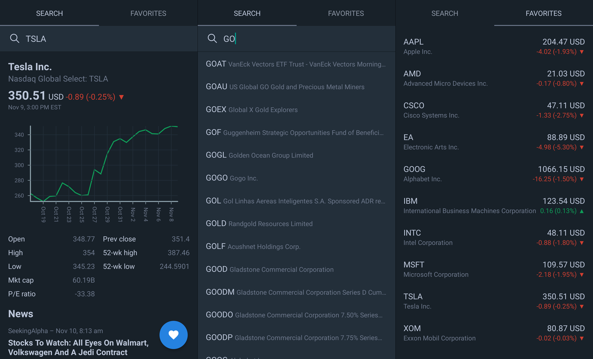

# Markets React

Ever want to check the stock market, but you just couldn't figure out how? Well look no further, this app has got you covered! Built with React Native, Expo, and NativeBase using data from EX API.



## Getting Started

First, head over to the [Expo installation guide](https://docs.expo.io/versions/latest/introduction/installation.html) to get your development environment set up.

``` bash
# clone repo
git clone git@github.com:krestaino/stock-check.git

# install dependencies
yarn install

# start development server
yarn start

# build
expo build:android
# or
expo build:ios
```

## Store Links
* [Google Play](https://play.google.com/store/apps/details?id=com.kmr.marketsreact)
* App Store (coming soon!)

## Built With
* [React Native](https://facebook.github.io/react-native/docs/getting-started.html)
* [Expo](https://docs.expo.io/versions/latest/)
* [NativeBase](https://docs.nativebase.io/)
* [EX API](https://iextrading.com/developer/docs/#getting-started)

## License 
This project is licensed under the MIT License - see the LICENSE.md file for details
